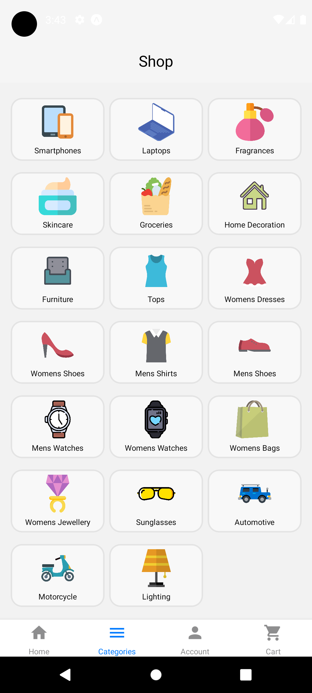
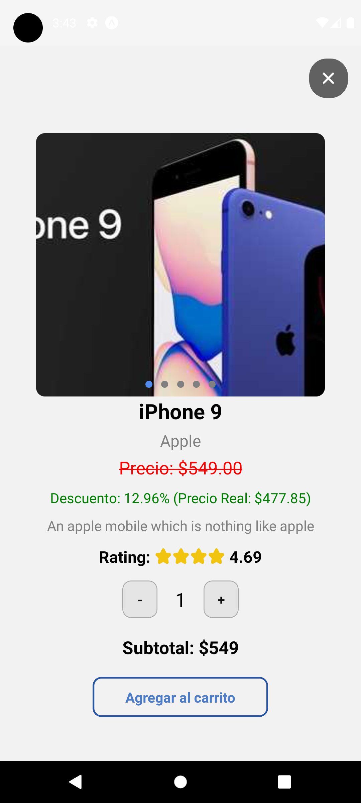

# Nombre de la Aplicación: Tienda Virtual

## Descripción

La aplicación **Tienda Virtual** es una plataforma de comercio electrónico diseñada para permitir a los usuarios explorar, comprar y realizar pedidos de una amplia variedad de productos. Con una interfaz intuitiva y funciones modernas, esta aplicación ofrece una experiencia de compra fluida y conveniente para los usuarios.

## Características Principales

- **Exploración de Productos:** Los usuarios pueden navegar por una amplia gama de productos organizados por categorías.
- **Registro de Usuarios:** Permite a los usuarios registrarse en la aplicación proporcionando información básica como nombre, correo electrónico y fecha de nacimiento.
- **Autenticación:** Los usuarios pueden iniciar sesión de manera segura utilizando sus credenciales registradas.
- **Perfil de Usuario:** Los usuarios pueden ver y editar su información personal en su perfil, incluyendo detalles como nombre, correo electrónico y fecha de nacimiento.
- **Cámara y Galería:** La aplicación permite a los usuarios tomar fotos utilizando la cámara del dispositivo o seleccionar imágenes de la galería para cargarlas como productos o para el perfil.
- **Generación de Ordenes:** Los usuarios pueden agregar productos al carrito, revisar su pedido y generar órdenes de compra.
- **Gestión de Direcciones:** Los usuarios pueden almacenar y gestionar múltiples direcciones de envío para sus órdenes.
- **Seguimiento de Órdenes:** Los usuarios pueden ver el estado de sus órdenes y realizar un seguimiento de la entrega.
- **Almacenamiento Local:** Utiliza SQLite para almacenar localmente la información del usuario en el dispositivo móvil para un acceso rápido y eficiente.

## Instalación

1. Clona este repositorio:

```bash
git clone https://github.com/tu-usuario/tu-repo.git
```

2. Navega al directorio de la aplicación:

```bash
cd nombre-app
```

3. Instala las dependencias:

```bash
npm install
```
o
```bash
yarn install
```

## Uso

1. Ejecuta la aplicación:

```bash
npm start
```
o
```bash
yarn start
```

2. Abre la aplicación Expo Go en tu dispositivo móvil.

3. Escanea el código QR generado por Expo CLI.

## Capturas de Pantalla

### Exploración de Productos
<div align="center">
    
    
    
    
</div>

### Carrito y Órdenes
<div align="center">
    
    
    
</div>


### Autenticación y Perfil
<div align="center">
    
    
    
    
    
    
</div>


## Tecnologías Utilizadas

- **Expo:** Plataforma de desarrollo de aplicaciones móviles.
- **React Native:** Biblioteca de JavaScript para construir interfaces de usuario móviles.
- **Firebase:** Plataforma de desarrollo de aplicaciones móviles y web de Google.
- **SQLite:** Sistema de gestión de bases de datos relacional.
- **Redux Toolkit:** Librería de gestión de estado para aplicaciones JavaScript.
- **React Navigation:** Biblioteca de enrutamiento y navegación para React Native.
--- 


